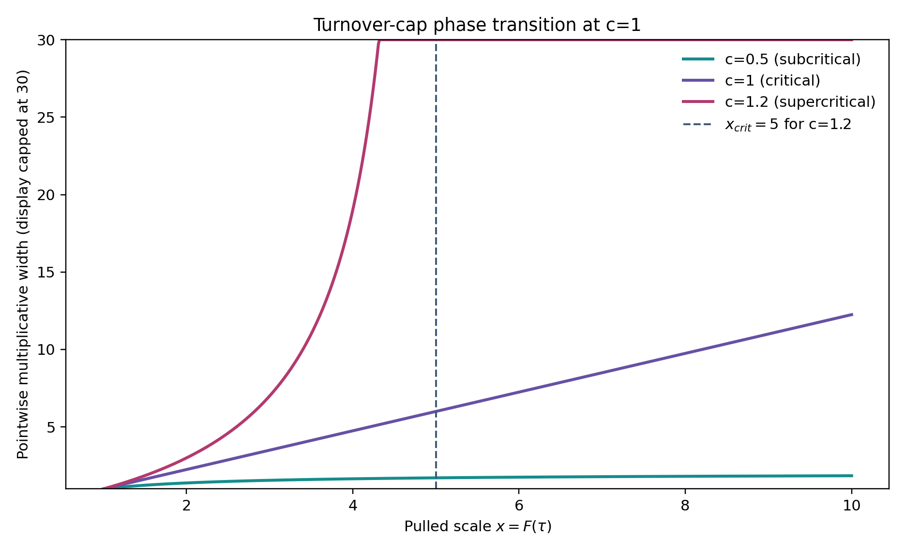
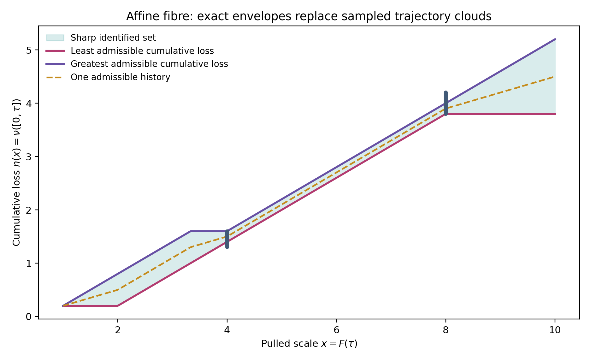
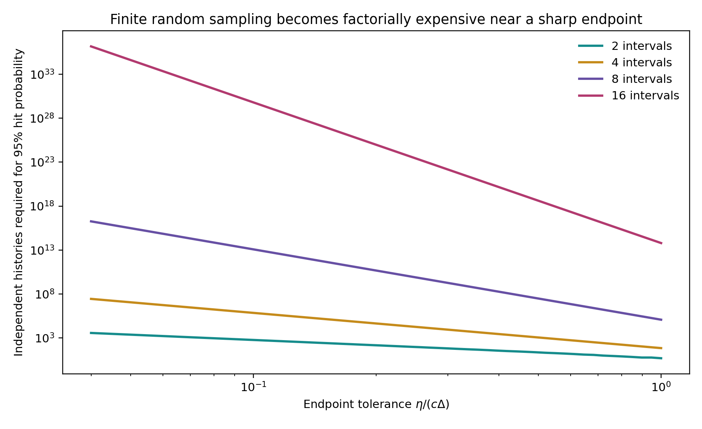
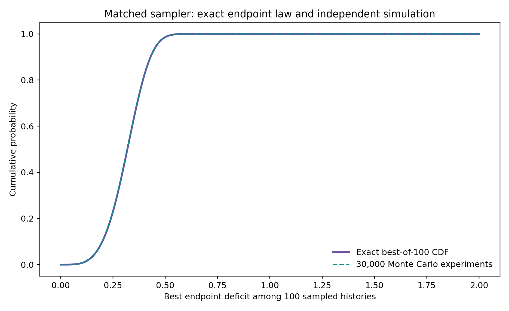
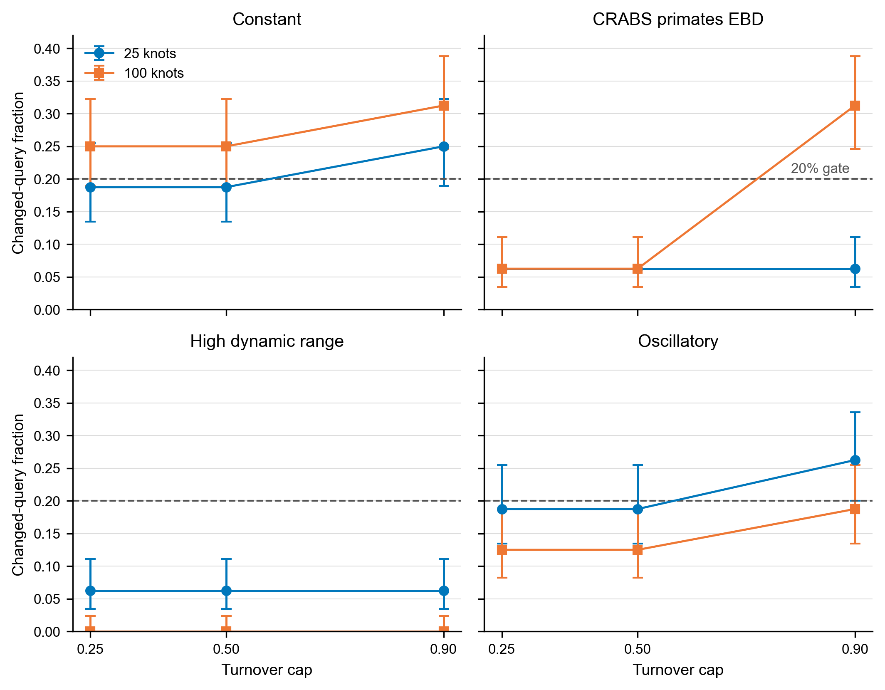
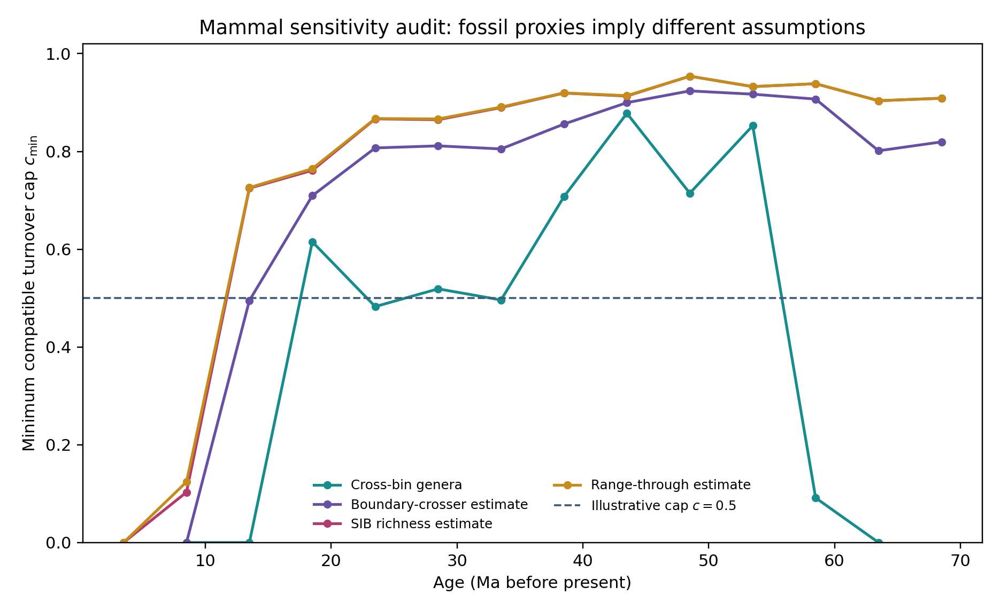
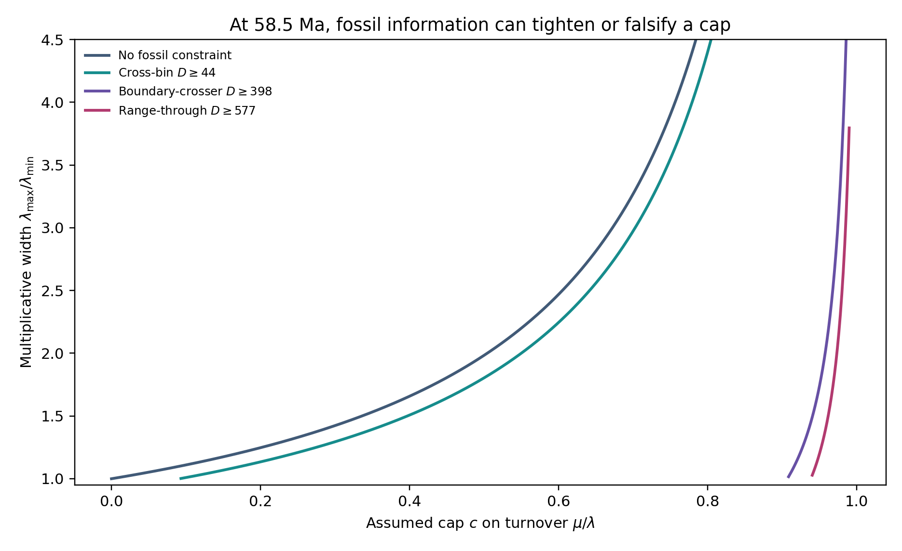
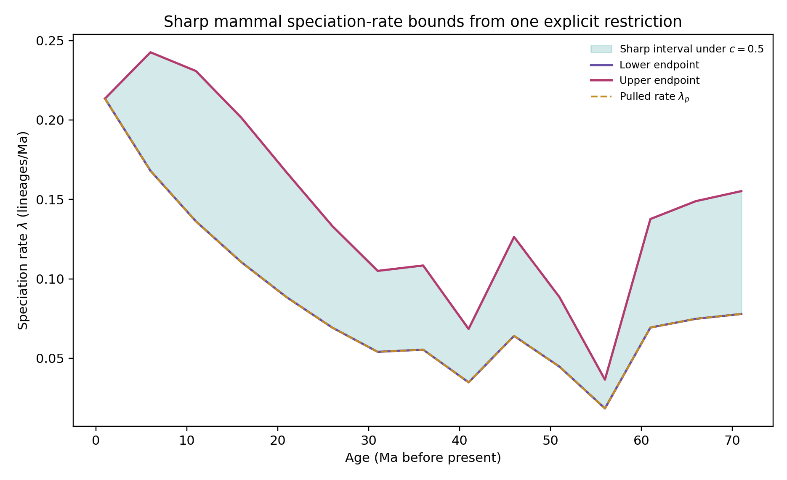
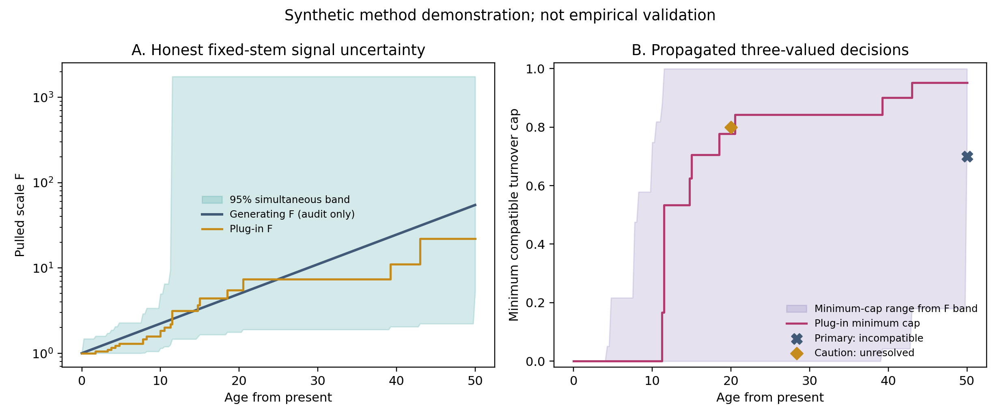

# Finite-Sample Signal Uncertainty and Sharp Partial Identification of Diversification Histories

## An Affine Signal-to-Decision Workflow with a Bounded CRABS Comparison

Anonymous — Route A revision `0.3.0-candidate-r2`, 21 August 2026

## Abstract

Extant timetree likelihoods depend on a pulled diversification signal but do not generally identify homogeneous time-varying speciation and extinction rates separately. We give a finite-sample route from one exact fixed-stem reconstructed tree to uncertainty-aware partial-identification decisions. Conditional on stem survival, the tip count is geometric with parameter $`p=1/F(T)`$ and, conditional on that count, the unordered node ages are independent with a known transformation of the pulled scale $`F`$. Exact tail inversion for $`p`$ and a Dvoretzky–Kiefer–Wolfowitz–Massart band for the node-age distribution therefore yield a simultaneous confidence set for the full $`F`$ trajectory. Bonferroni propagation gives at least the stated finite-sample coverage under the fixed-stem homogeneous model. We combine this set with an affine cumulative-loss representation, sharp turnover-cap bounds and finite infeasibility certificates. In a frozen synthetic example with 22 tips, a 95% band gives $`F(T)\in[5.31,1749.48]`$: it rules out a registered cap of 0.70 under a stated normalized deterministic-diversity constraint, while an interior plug-in “compatible” decision becomes correctly unresolved. A 20,000-replicate sanity check gives 96.755% joint component coverage; the theorem, not the simulation, supplies the guarantee. A separate prospectively frozen CRABS benchmark found endpoint deficits in 240/240 returned clouds plus 60 structural censors, but certification changed only 532/3,840 clustered decision queries (13.854%), below the 20% H4 gate. The result is an uncertainty-aware diagnostic workflow for homogeneous fixed-stem models, not empirical validation, an observation model, or an essential CRABS complement.

#### Assurance boundary.

This is an unrefereed Route-A revision candidate. Internal replay, independent linear-programming checks, direct branching-process simulation, deliberate negative controls, the fixed-stem uncertainty implementation and the sealed affine–CRABS ledger pass their stated integrity checks. The simultaneous band covers sampling variation under the exact fixed-stem, stem-survival, homogeneous time-varying law only; it does not cover topology or dating error, smoothing, lineage heterogeneity, model misspecification or a fossil observation process. The failed H4 utility gate is retained and prohibits “must-have” or essential-complement language. External process-theory review and unaffiliated full replay remain outstanding. “Sharp” always means sharp over the stated conditional model class.

#### Persistent identifier.

The prior 0.2.1 candidate is archived at [10.5281/zenodo.21851319](https://doi.org/10.5281/zenodo.21851319). This 0.3.0-candidate-r2 review draft is not yet archived and must not be attributed to that specific-version DOI.

# Decision problem and contribution

Let $`\tau\in[0,T]`$ denote age before an analysis origin, with $`\tau=0`$ at that origin and larger $`\tau`$ further in the past. A homogeneous time-varying birth–death history has speciation rate $`\lambda(\tau)>0`$, extinction rate $`\mu(\tau)\geq0`$, and sampling probability $`\rho\in(0,1]`$ at the analysis origin. If $`E(\tau)`$ is the probability that a lineage at age $`\tau`$ leaves no sampled descendant, define
``` math
\begin{equation}
 u(\tau)=1-E(\tau),\qquad \lambda_p(\tau)=\lambda(\tau)u(\tau). \label{eq:definitions}
\end{equation}
```
Under the generalized homogeneous model, the reconstructed extant-timetree likelihood depends on $`\lambda`$ and $`\mu`$ through the pulled quantity $`\lambda_p`$; this likelihood-level identification does not by itself make a time-varying function precisely estimable from finite data. The component rates $`\lambda`$ and $`\mu`$ are not separately identified without further restrictions (Louca and Pennell 2020; Helmstetter et al. 2022; Morlon et al. 2022; Title et al. 2026).

Existing tools construct or sample histories in the resulting congruence class (Höhna et al. 2022; Andréoletti and Morlon 2023; Kopperud et al. 2023). They answer an exploration question. The target here is a partial-identification question:

> From one fixed-stem tree, which signal trajectories and diversification histories remain compatible with sampling variation and explicit restrictions, and which target decisions are resolved rather than plug-in artefacts?

The principal contribution is a finite-sample fixed-stem signal-to-decision workflow: an honest simultaneous set for $`F`$, a confidence-containing union of conditional affine fibres and a three-valued target decision. Four supporting results make that workflow auditable: a cumulative-loss coordinate with explicit measure subclasses; all-cap sharp bounds and finite certificates; an exact endpoint-sampling law; and a prospectively frozen CRABS comparison whose failed utility gate is retained. The method is restricted to homogeneous time-varying branching with exact node ages. Lineage-, state-, trait-, clade- and diversity-dependent processes lie outside the one-dimensional fibre.

# Smooth affine fibre

Assume that $`\lambda_p`$ is continuous and strictly positive and define
``` math
\begin{equation}
 F(\tau)=\exp\!\left\{\int_0^\tau\lambda_p(s)\,\mathrm{d}s\right\},
 \qquad F(0)=1,\qquad F'=\lambda_pF. \label{eq:F}
\end{equation}
```
The survival probability satisfies
``` math
\begin{equation}
 u'=\lambda_p(1-u)-\mu u,\qquad u(0)=\rho. \label{eq:survival}
\end{equation}
```
Set
``` math
\begin{equation}
 A(\tau)=F(\tau)[1-u(\tau)]. \label{eq:A}
\end{equation}
```

<div id="thm:smooth" class="theorem">

**Theorem 1** (Smooth affine-fibre representation). *Fix $`\lambda_p>0`$ and $`F`$ from <a href="#eq:F" data-reference-type="eqref" data-reference="eq:F">[eq:F]</a>. The map
``` math
(\rho,\lambda,\mu)\longmapsto A=F\left(1-\frac{\lambda_p}{\lambda}\right)
```
is a bijection between histories with continuous rates $`\lambda>0`$ and $`\mu\geq0`$ and pulled rate $`\lambda_p`$ and functions $`A\in C^1([0,T])`$ satisfying
``` math
0\leq A(0)<1,\qquad A'\geq0,\qquad A<F.
```
The inverse is
``` math
\begin{equation}
 \rho=1-A(0),\qquad u=\frac{F-A}{F},\qquad
 \lambda=\frac{\lambda_pF}{F-A},\qquad \mu=\frac{A'}{F-A}. \label{eq:inverse}
\end{equation}
```
If $`\nu`$ is the positive measure with cumulative function $`A`$, then
``` math
\begin{equation}
 \nu=(1-\rho)\delta_0+A'(\tau)\,\mathrm{d}\tau,
 \qquad \frac{\,\mathrm{d}\nu_{\mathrm{ac}}}{\,\mathrm{d}F}=\frac{\mu}{\lambda}
 \quad\text{almost everywhere}. \label{eq:RN}
\end{equation}
```*

</div>

Here a continuous-rate history means $`(\rho,\lambda,\mu)\in(0,1]\times C([0,T])\times C([0,T])`$ with the displayed sign restrictions. Its survival solution is $`C^1`$. The theorem does not claim that $`\lambda`$ or $`\mu`$ is continuously differentiable when only $`\lambda_p\in C([0,T])`$ and $`A\in C^1([0,T])`$ are assumed.

<div class="proof">

*Proof.* Differentiate <a href="#eq:A" data-reference-type="eqref" data-reference="eq:A">[eq:A]</a>, use $`F'=\lambda_pF`$ and substitute <a href="#eq:survival" data-reference-type="eqref" data-reference="eq:survival">[eq:survival]</a>:
``` math
A'=\lambda_pF(1-u)-F\{\lambda_p(1-u)-\mu u\}=\mu uF\geq0.
```
The initial value is $`A(0)=1-\rho`$, and $`A<F`$ is equivalent to $`u>0`$. Conversely, <a href="#eq:inverse" data-reference-type="eqref" data-reference="eq:inverse">[eq:inverse]</a> defines positive $`u`$ and $`\lambda`$ and non-negative $`\mu`$; direct substitution recovers <a href="#eq:survival" data-reference-type="eqref" data-reference="eq:survival">[eq:survival]</a> and $`\lambda_p=\lambda u`$. Finally,
``` math
\frac{\,\mathrm{d}\nu_{\mathrm{ac}}}{\,\mathrm{d}F}=\frac{A'}{F'}=\frac{\mu uF}{\lambda_pF}=\frac{\mu}{\lambda}.
```
 ◻

</div>

At each age,
``` math
\begin{equation}
 \frac1{\lambda(\tau)}=\frac1{\lambda_p(\tau)}-
 \frac{A(\tau)}{\lambda_p(\tau)F(\tau)}, \label{eq:affine}
\end{equation}
```
so reciprocal speciation is affine in $`\nu`$. The admissible fibre
``` math
\begin{equation}
 \mathcal{V}_F=\{\nu\in\mathcal{M}_+([0,T]):\nu([0,\tau])<F(\tau)\ \forall\tau\} \label{eq:fibre}
\end{equation}
```
is convex and closed under pointwise meet and join of cumulative functions. It is not a cone because positive scaling can cross the barrier. Larger cumulative loss means larger $`\lambda`$, smaller $`u`$ and smaller $`1/\lambda`$.

# Measure completion and finite survival events

For a finite positive Radon measure $`\nu\in\mathcal{V}_F`$, let
``` math
\begin{equation}
 A(\tau)=\nu([0,\tau]),\qquad q(\tau)=F(\tau)-A(\tau),\qquad u=q/F. \label{eq:q}
\end{equation}
```
Use right-continuous cumulative functions. Because age increases into the past, $`a-`$ denotes the younger-side limit and $`a+`$ the older-side limit. Let $`q_-(\tau)=F(\tau)-A(\tau^-)`$. Define
``` math
\begin{equation}
 \,\mathrm{d}K(\tau)=\frac{\,\mathrm{d}\nu(\tau)}{q_-(\tau)}. \label{eq:K}
\end{equation}
```

<div id="prop:stieltjes" class="proposition">

**Proposition 2** (Stieltjes loss equation). *The survival function solves
``` math
\begin{equation}
 \,\mathrm{d}u=\lambda_p(1-u)\,\mathrm{d}\tau-u_-\,\mathrm{d}K. \label{eq:stieltjes}
\end{equation}
```
On the absolutely continuous part, $`\,\mathrm{d}K/\,\mathrm{d}\tau=\mu`$. If $`\nu`$ has an atom $`m`$ at age $`a`$, then
``` math
\begin{equation}
 u(a+)=s_au(a-),\qquad q(a+)=s_aq(a-),\qquad
 m=(1-s_a)q(a-), \label{eq:eventjump}
\end{equation}
```
where $`s_a=1-m/q(a-)\in(0,1]`$.*

</div>

<div class="proof">

*Proof.* Since $`u=1-A/F`$ and $`F`$ is continuous,
``` math
\,\mathrm{d}u=\lambda_p(1-u)\,\mathrm{d}\tau-F^{-1}\,\mathrm{d}A.
```
Because $`q_-=Fu_-`$ and $`\,\mathrm{d}A=\,\mathrm{d}\nu=q_-\,\mathrm{d}K`$, this is <a href="#eq:stieltjes" data-reference-type="eqref" data-reference="eq:stieltjes">[eq:stieltjes]</a>. The strict barrier gives $`m<q(a-)`$; taking jumps yields <a href="#eq:eventjump" data-reference-type="eqref" data-reference="eq:eventjump">[eq:eventjump]</a>. ◻

</div>

The boundary atom at zero is the coordinate representation of incomplete sampling. An interior atom represents independent deterministic survival thinning of every contemporaneous lineage with the same probability; it is not a point value of the continuous ratio $`\mu/\lambda`$. State-, lineage- or diversity-dependent thinning is not covered.

<div id="tab:modelclasses">

| Class | Mathematical object | Results that apply |
|:---|:---|:---|
| Continuous-rate history | $`\lambda,\mu\in C`$, $`A\in C^1`$ | Smooth affine bijection and reciprocal-rate identity |
| Absolutely continuous fibre | $`\,\mathrm{d}\nu=(1-\rho)\delta_0+\varepsilon\,\mathrm{d}F`$ | Turnover-cap bounds, finite envelopes and certificates |
| Finite-event history | Absolutely continuous background plus finitely many independent common-survival atoms | Descendant-count and topology-marginal fixed-stem laws |
| General finite Radon measure | May include singular-continuous mass | Stieltjes coordinate algebra only; no process-law claim here |
| Lineage/state-dependent process | Rates or thinning vary among contemporaneous lineages | Outside this paper’s one-dimensional homogeneous fibre |

Applicability map. Event atoms are outside the continuous turnover cap unless an additional event restriction is stated.

</div>

## Descendant-count law

Let $`N_\tau`$ be the number of sampled descendants at the analysis origin from one lineage at age $`\tau`$, with probability-generating function
``` math
G_\tau(z)=\mathbb E[z^{N_\tau}]=\sum_{k\geq0}p_k(\tau)z^k.
```
Between events,
``` math
\begin{equation}
 \partial_\tau G=\lambda(G^2-G)+\mu(1-G),\qquad
 G_0(z)=1-\rho+\rho z. \label{eq:pgf}
\end{equation}
```
At an event with survival $`s_a`$, moving from the younger to the older side,
``` math
\begin{equation}
 G_{a+}(z)=1-s_a+s_aG_{a-}(z). \label{eq:pgfevent}
\end{equation}
```

<div id="thm:geometric" class="theorem">

**Theorem 3** (Zero-inflated geometric law with finite events). *For an absolutely continuous history with finitely many deterministic survival events,
``` math
\begin{equation}
 G_\tau(z)=1-u(\tau)+u(\tau)
 \frac{a(\tau)z}{1-[1-a(\tau)]z},
 \qquad a(\tau)=\frac1{F(\tau)}. \label{eq:zig}
\end{equation}
```
Thus
``` math
\begin{equation}
 p_0=1-u,\qquad p_k=\frac{u}{F}\left(1-\frac1F\right)^{k-1},\quad k\geq1, \label{eq:pk}
\end{equation}
```
and
``` math
\begin{equation}
 \frac{p_1}{u}=\frac1F,\qquad
 \Pr(N_\tau=k\mid N_\tau>0)=\frac1F\left(1-\frac1F\right)^{k-1}. \label{eq:conditionalgeometric}
\end{equation}
```
Finite events change $`u`$ but not the conditional positive descendant-count law.*

</div>

<div class="proof">

*Proof.* At $`\tau=0`$, $`a=1`$ and <a href="#eq:zig" data-reference-type="eqref" data-reference="eq:zig">[eq:zig]</a> equals $`1-\rho+\rho z`$. Between events, $`a'=-\lambda_pa=-\lambda ua`$. Differentiate <a href="#eq:zig" data-reference-type="eqref" data-reference="eq:zig">[eq:zig]</a>, substitute $`u'=\lambda u(1-u)-\mu u`$ and $`a'=-\lambda ua`$, and recover <a href="#eq:pgf" data-reference-type="eqref" data-reference="eq:pgf">[eq:pgf]</a>. Uniqueness of the backward equation proves the form between events. Equation <a href="#eq:pgfevent" data-reference-type="eqref" data-reference="eq:pgfevent">[eq:pgfevent]</a> multiplies $`u`$ by $`s_a`$ without changing $`a=1/F`$, so the form persists across every event. Expanding the geometric series gives <a href="#eq:pk" data-reference-type="eqref" data-reference="eq:pk">[eq:pk]</a>–<a href="#eq:conditionalgeometric" data-reference-type="eqref" data-reference="eq:conditionalgeometric">[eq:conditionalgeometric]</a>. ◻

</div>

## Fixed-stem tip-count and ordered-node-age law

Fix a stem age $`T`$ and condition on the stem leaving at least one sampled descendant. The probability object in this subsection is
``` math
\Omega_T=\bigsqcup_{n\geq1}\{n\}\times\Delta_{n-1}(T),\qquad
 \Delta_{n-1}(T)=\{0<t_1<\cdots<t_{n-1}<T\},
```
equipped with counting measure in $`n`$ and Lebesgue measure on each ordered simplex; $`\Delta_0(T)`$ is a singleton. Ranked, oriented or labelled topology is marginalised, not left implicit. Define
``` math
\begin{equation}
 h(t)=\lambda(t)p_1(t)=\frac{\lambda_p(t)}{F(t)}=-\frac{\,\mathrm{d}}{\,\mathrm{d}t}\frac1{F(t)}, \label{eq:h}
\end{equation}
```
so $`\int_0^T h(t)\,\mathrm{d}t=1-1/F(T)`$.

<div id="thm:fixedstem" class="theorem">

**Theorem 4** (Fixed-stem count and ordered-node-age congruence). *Under <a href="#thm:geometric" data-reference-type="ref+label" data-reference="thm:geometric">3</a>, the unconditioned joint density of $`N_T=n`$ and the ordered internal-node ages, with ranked topology marginalised, is
``` math
\begin{equation}
 g_{n,T}(t_1,\ldots,t_{n-1})=p_1(T)\prod_{i=1}^{n-1}i\lambda(t_i)p_1(t_i). \label{eq:unconditionedtree}
\end{equation}
```
It integrates to $`p_n(T)`$. Conditional on stem survival,
``` math
\begin{equation}
 f^{\mathrm{surv}}_{n,T}(t_1,\ldots,t_{n-1})
 =\frac{(n-1)!}{F(T)}\prod_{i=1}^{n-1}\frac{\lambda_p(t_i)}{F(t_i)}, \label{eq:survivaldensity}
\end{equation}
```
and conditional additionally on $`N_T=n`$,
``` math
\begin{equation}
 f^n_T(t_1,\ldots,t_{n-1})
 =\frac{(n-1)!}{[1-1/F(T)]^{n-1}}
 \prod_{i=1}^{n-1}\frac{\lambda_p(t_i)}{F(t_i)}. \label{eq:countdensity}
\end{equation}
```
Hence histories sharing $`\lambda_p`$ have the same law on $`\Omega_T`$ under either displayed conditioning, including histories with finitely many independent common-survival events. No probability mass on labelled, oriented or ranked topologies is asserted by this theorem.*

</div>

<div class="proof">

*Proof.* The branching property gives <a href="#eq:unconditionedtree" data-reference-type="eqref" data-reference="eq:unconditionedtree">[eq:unconditionedtree]</a> for the topology-marginal ordered ages. Before the first observed split the stem contributes $`p_1(T)`$. With $`i`$ reconstructed lineages, summing over which lineage generates the next observed split produces $`i\lambda(t_i)`$, and the new observed branch contributes $`p_1(t_i)`$. Independent common-survival thinning preserves this recursion. By <a href="#eq:pk" data-reference-type="eqref" data-reference="eq:pk">[eq:pk]</a> and <a href="#eq:h" data-reference-type="eqref" data-reference="eq:h">[eq:h]</a>,
``` math
g_{n,T}=\frac{u(T)}{F(T)}(n-1)!\prod_{i=1}^{n-1}h(t_i).
```
Integration over the ordered simplex yields
``` math
\frac{u(T)}{F(T)}(n-1)!\frac1{(n-1)!}
 \left\{\int_0^Th(t)\,\mathrm{d}t\right\}^{n-1}
 =\frac{u(T)}{F(T)}\left(1-\frac1{F(T)}\right)^{n-1}=p_n(T).
```
Dividing by $`u(T)`$ proves <a href="#eq:survivaldensity" data-reference-type="eqref" data-reference="eq:survivaldensity">[eq:survivaldensity]</a>; dividing by the conditional geometric probability in <a href="#eq:conditionalgeometric" data-reference-type="eqref" data-reference="eq:conditionalgeometric">[eq:conditionalgeometric]</a> proves <a href="#eq:countdensity" data-reference-type="eqref" data-reference="eq:countdensity">[eq:countdensity]</a>. ◻

</div>

<div id="rem:scope" class="remark">

**Remark 5** (Conditioning scope). <a href="#thm:fixedstem" data-reference-type="ref+Label" data-reference="thm:fixedstem">4</a> fixes stem age and covers stem-survival and observed-tip-count conditioning on the explicitly topology-marginal space $`\Omega_T`$. A fuller tree object requires a separately stated topology convention and mass function. The theorem does not claim equality under random-origin priors, crown conditioning or other normalisers. Those cases require separate derivations. Reconstructed-process, conditioned-node-time and coalescent-point-process results are direct antecedents (Nee et al. 1994; Gernhard 2008; Stadler 2010; Lambert and Stadler 2013; Höhna 2015; Stadler and Steel 2019; MacPherson et al. 2022).

</div>

# Turnover caps and the phase transition at $`c=1`$

In pulled-scale time $`x=F(\tau)`$, set $`n(x)=A(F^{-1}(x))`$ and $`q(x)=x-n(x)`$. For absolutely continuous histories,
``` math
\begin{equation}
 n'(x)=\frac{\mu}{\lambda}=: \varepsilon(x),\qquad
 q'(x)=1-\varepsilon(x),\qquad n(1)=1-\rho,\qquad q(1)=\rho. \label{eq:turnover}
\end{equation}
```
Assume no interior atoms and impose $`0\leq\varepsilon\leq c`$ for a finite $`c\geq0`$.

<div id="thm:cap" class="theorem">

**Theorem 6** (Sharp pointwise bounds for every finite turnover cap). *At any pulled scale $`x\geq1`$,
``` math
\begin{equation}
 q(x)\leq\rho+x-1, \label{eq:qupper}
\end{equation}
```
and
``` math
\begin{equation}
 \inf q(x)=\max\{\rho+(1-c)(x-1),0\}. \label{eq:qinf}
\end{equation}
```
The upper endpoint is attained by $`\varepsilon=0`$. The lower endpoint is attained by $`\varepsilon=c`$ when $`\rho+(1-c)(x-1)>0`$; otherwise zero is an unattained infimum because $`q>0`$. Consequently,
``` math
\begin{equation}
 \lambda_{\min}(x)=\frac{\lambda_p(x)x}{\rho+x-1}, \label{eq:lmin}
\end{equation}
```
while
``` math
\begin{equation}
 \sup\lambda(x)=
 \begin{cases}
 \displaystyle\frac{\lambda_p(x)x}{\rho+(1-c)(x-1)},&\rho+(1-c)(x-1)>0,\\[6pt]
 +\infty,&\rho+(1-c)(x-1)\leq0.
 \end{cases} \label{eq:lsup}
\end{equation}
```*

</div>

<div class="proof">

*Proof.* Integrating $`1-c\leq q'\leq1`$ from $`x=1`$ gives the candidate endpoints while they remain positive. The upper endpoint follows from $`\varepsilon=0`$. If the lower affine expression is positive, $`\varepsilon=c`$ attains it. If it is non-positive, choose a constant $`\varepsilon\leq c`$ that gives any prescribed $`q(x)=\delta>0`$; along the linear path, $`q`$ remains positive. Letting $`\delta\downarrow0`$ proves the infimum. Since $`\lambda=\lambda_px/q`$, the rate bounds follow. ◻

</div>

<div id="cor:regimes" class="corollary">

**Corollary 7** (Three cap regimes). *The identification geometry has three regimes.*

1.  *If $`c<1`$, the multiplicative width obeys
    ``` math
    \begin{equation}
     \frac{\lambda_{\max}}{\lambda_{\min}}
     =\frac{\rho+x-1}{\rho+(1-c)(x-1)}\leq\frac1{1-c}. \label{eq:globalfactor}
    \end{equation}
    ```*

2.  *If $`c=1`$, both pointwise endpoints are finite and attained for every finite $`x`$, but the width $`(\rho+x-1)/\rho`$ has no uniform deep-time bound.*

3.  *If $`c>1`$, define
    ``` math
    \begin{equation}
     x_{\mathrm{crit}}=1+\frac{\rho}{c-1}. \label{eq:xcrit}
    \end{equation}
    ```
    The speciation supremum is finite below $`x_{\mathrm{crit}}`$ and infinite at and beyond it.*

</div>

The familiar assumption $`c\leq1`$ means $`\mu\leq\lambda`$ at every non-event time and therefore excludes continuous negative net diversification. The extension to $`c>1`$ makes the cost of allowing decline explicit rather than hiding it in a sampler.

<div id="tab:capbiology">

| Cap regime | Permits | Excludes or weakens |
|:---|:---|:---|
| $`c=0`$ | Pure-birth continuous background | Every continuous extinction contribution |
| $`0<c<1`$ | Extinction below speciation at every ordinary time; finite uniform identification factor | Every interval of continuous negative net diversification; common-survival events remain separate atoms |
| $`c=1`$ | Zero net diversification as a boundary | Continuous decline; no uniform deep-time width bound |
| $`c>1`$ | Bounded intervals of continuous decline | Unbounded turnover; speciation upper bounds diverge after $`x_{\rm crit}`$ |
| Time-varying $`c(x)`$ | Scientifically varying ceilings, if supplied | Not covered by the closed forms here; finite constraints can be handled by interval-specific directed slopes |

Biological reading of the turnover restriction. No cap value is presented as natural; applications should report a justified sensitivity range.

</div>

<figure id="fig:phase" data-latex-placement="t">

<figcaption>Pointwise identification width for <span class="math inline"><em>ρ</em> = 0.8</span>. For <span class="math inline"><em>c</em> &lt; 1</span> the width has a finite global limit; at <span class="math inline"><em>c</em> = 1</span> it grows without a global bound; for <span class="math inline"><em>c</em> &gt; 1</span> it diverges at the vertical critical pulled scale. The displayed width is capped at 30. These are conditional mathematical bounds, not empirical estimates.</figcaption>
</figure>

# Finite constraints: exact envelopes and certificates

Suppose external or structural information gives
``` math
\begin{equation}
 L_i\leq n(x_i)\leq U_i,\qquad 1\leq x_0<\cdots<x_m. \label{eq:intervals}
\end{equation}
```
The present anchor is normally included as $`x_0=1`$ and $`L_0=U_0=1-\rho`$.

<div id="thm:envelopes" class="theorem">

**Theorem 8** (Directed-Lipschitz feasibility and sharp envelopes). *There exists a non-decreasing, $`c`$-Lipschitz function satisfying <a href="#eq:intervals" data-reference-type="eqref" data-reference="eq:intervals">[eq:intervals]</a> if and only if
``` math
\begin{equation}
 L_i\leq U_j+c(x_i-x_j)_+\qquad\text{for every }i,j. \label{eq:pairwise}
\end{equation}
```
When feasible, the least and greatest such functions are
``` math
\begin{align}
 \underline n(x)&=\max_i\{L_i-c(x_i-x)_+\}, \label{eq:lowerenv}\\
 \overline n(x)&=\min_i\{U_i+c(x-x_i)_+\}. \label{eq:upperenv}
\end{align}
```
Every feasible $`n`$ obeys $`\underline n\leq n\leq\overline n`$, and both envelopes are feasible. A violating pair $`(i,j)`$ is a complete finite certificate of generic infeasibility.*

</div>

<div class="proof">

*Proof.* Monotonicity and the slope cap imply
``` math
n(x)\geq L_i-c(x_i-x)_+,\qquad n(x)\leq U_i+c(x-x_i)_+.
```
Taking the maximum and minimum gives the necessary bounds and <a href="#eq:pairwise" data-reference-type="eqref" data-reference="eq:pairwise">[eq:pairwise]</a>. Each lower cone is non-decreasing and $`c`$-Lipschitz, and pointwise maxima preserve both properties. Under <a href="#eq:pairwise" data-reference-type="eqref" data-reference="eq:pairwise">[eq:pairwise]</a>, $`\underline n(x_j)\leq U_j`$, while construction gives $`\underline n(x_j)\geq L_j`$; hence $`\underline n`$ is feasible and least. The upper proof is symmetric. ◻

</div>

<div id="cor:barrier" class="corollary">

**Corollary 9** (Positive-survival barrier). *Let the domain be $`[1,X]`$ and include the anchor $`n(1)=1-\rho`$. For $`c\leq1`$, generic feasibility in <a href="#thm:envelopes" data-reference-type="ref+label" data-reference="thm:envelopes">8</a> automatically implies $`n(x)<x`$. For $`c>1`$, a positive-survival history exists if and only if <a href="#eq:pairwise" data-reference-type="eqref" data-reference="eq:pairwise">[eq:pairwise]</a> holds and
``` math
\begin{equation}
 L_i<x_i\qquad\text{for every }i. \label{eq:barrierfinite}
\end{equation}
```
In that case the least envelope itself respects the barrier.*

</div>

<div class="proof">

*Proof.* For $`c\leq1`$, the anchor and $`n'\leq c`$ give $`n(x)\leq1-\rho+c(x-1)<x`$. For $`c>1`$, consider one lower cone $`\phi_i(x)=L_i-c(x_i-x)_+`$. The function $`\phi_i(x)-x`$ increases up to $`x_i`$ and decreases afterwards, so its maximum is $`L_i-x_i`$. Hence, if every $`L_i<x_i`$, the least envelope $`\underline n=\max_i\phi_i`$ satisfies $`\underline n(x)<x`$ throughout the domain and supplies an admissible feasible history. Conversely, if $`L_i\geq x_i`$ for some $`i`$, every function satisfying that lower constraint has $`n(x_i)\geq L_i\geq x_i`$ and violates positive survival at $`x_i`$. ◻

</div>

<div id="cor:mincap" class="corollary">

**Corollary 10** (Minimum compatible turnover cap). *If $`L_i\leq U_j`$ whenever $`x_i\leq x_j`$, the smallest generic cap is
``` math
\begin{equation}
 c_\star=\max_{x_i>x_j}\frac{(L_i-U_j)_+}{x_i-x_j}. \label{eq:cstar}
\end{equation}
```
If some $`x_i\leq x_j`$ has $`L_i>U_j`$, monotonicity alone makes the system infeasible for every finite cap. A result $`c_\star>1`$ means that every absolutely continuous solution requires some negative-net-diversification interval, unless the data bridge, event structure or other assumptions change.*

</div>

<div id="cor:order" class="corollary">

**Corollary 11** (Order-monotone targets). *Let $`\Psi[n]`$ be increasing under pointwise cumulative-loss order. Over a feasible set from <a href="#thm:envelopes" data-reference-type="ref+label" data-reference="thm:envelopes">8</a>,
``` math
\inf\Psi=\Psi[\underline n],\qquad \sup\Psi=\Psi[\overline n],
```
with reversed roles for decreasing targets. This covers point evaluations of $`n`$, $`A`$, $`\lambda`$ and the deterministic diversity quantity defined below, and positive weighted integrals of order-monotone transforms. Non-monotone targets, including peak timing and some path extrema, require a separate optimisation problem.*

</div>

The two envelopes describe the pointwise projection of the functional identified set. An arbitrary curve drawn inside the shaded band need not satisfy the cross-time constraints.

<figure id="fig:geometry" data-latex-placement="t">

<figcaption>Least and greatest feasible cumulative-loss trajectories under finite interval constraints. The shading is the pointwise projection between two feasible extremal functions; it is not a licence to choose values independently at each <span class="math inline"><em>x</em></span>.</figcaption>
</figure>

# Why finite random sampling is not certification

The distinction between exploration and certification can be quantified without criticising any particular implementation. Consider an equal pulled-scale grid $`x_j=1+j\Delta`$, $`j=0,\ldots,m`$, and independently draw each interval turnover $`\varepsilon_j\sim\mathrm{Uniform}(0,c)`$. The sharp maximal-loss endpoint is
``` math
\begin{equation}
 n_{\max}(x_m)=1-\rho+mc\Delta. \label{eq:nmax}
\end{equation}
```
A sampled endpoint has deficit
``` math
\begin{equation}
 D=n_{\max}(x_m)-n(x_m)=\Delta\sum_{j=1}^m(c-\varepsilon_j). \label{eq:deficit}
\end{equation}
```

<div id="thm:sampling" class="theorem">

**Theorem 12** (Factorial endpoint-sampling law). *Under the matched sampler above, $`\Pr(D=0)=0`$. For $`0\leq\eta\leq c\Delta`$,
``` math
\begin{equation}
 p_\eta:=\Pr(D\leq\eta)=\frac1{m!}\left(\frac{\eta}{c\Delta}\right)^m. \label{eq:smalltail}
\end{equation}
```
For $`N`$ independent sampled histories,
``` math
\begin{equation}
 \Pr\!\left(\min_{1\leq r\leq N}D_r\leq\eta\right)=1-(1-p_\eta)^N, \label{eq:bestofN}
\end{equation}
```
and the smallest $`N`$ giving probability at least $`\gamma`$ is
``` math
\begin{equation}
 N_{\min}=\left\lceil\frac{\log(1-\gamma)}{\log(1-p_\eta)}\right\rceil. \label{eq:Nmin}
\end{equation}
```*

</div>

<div class="proof">

*Proof.* The variables $`(c-\varepsilon_j)/c`$ are independent $`\mathrm{Uniform}(0,1)`$. Exact endpoint attainment has probability zero. For $`\eta/(c\Delta)\leq1`$, the event that their sum is at most $`\eta/(c\Delta)`$ is an $`m`$-simplex of volume $`[\eta/(c\Delta)]^m/m!`$ inside the unit cube. Equations <a href="#eq:bestofN" data-reference-type="eqref" data-reference="eq:bestofN">[eq:bestofN]</a>–<a href="#eq:Nmin" data-reference-type="eqref" data-reference="eq:Nmin">[eq:Nmin]</a> follow from independent order statistics. ◻

</div>

With eight intervals and relative tolerance $`\eta/(c\Delta)=0.2`$, a 95% hit probability requires 47,182,783,307 independent histories. With 16 intervals it requires about $`9.56\times10^{24}`$. This theorem concerns the transparent matched sampler only. Actual samplers can concentrate differently, but no finite random sample proves an endpoint unless its proposal mechanism supplies a corresponding coverage guarantee. The next section therefore evaluates CRABS directly instead of treating this analytic example as a software benchmark.

<figure id="fig:samplingcost" data-latex-placement="t">

<figcaption>Exact number of independent matched-sampler histories needed for a 95% chance of approaching the maximal-loss endpoint. The cost grows factorially with the number of independently sampled intervals.</figcaption>
</figure>

<figure id="fig:samplingcheck" data-latex-placement="t">

<figcaption>Exact best-of-100 endpoint-deficit distribution for four independently sampled intervals, compared with 30,000 direct Monte Carlo experiments. This validates the order-statistic calculation; it is not a benchmark of the CRABS package.</figcaption>
</figure>

# Prospectively frozen comparison with CRABS

## Design and decision rules

The confirmatory protocol was locally frozen before execution and before inspecting any confirmatory result; it was not registered in an external repository. The comparison uses the explicit bridge $`\rho=1`$, $`\lambda_{\mathrm{ref}}=\lambda_p`$ and $`\mu_{\mathrm{ref}}=0`$ on identical piecewise-linear time grids. CRABS’s `p.delta` proposal parameter is recorded separately from the pulled signal $`\lambda_p`$ and is never substituted for it.

The stochastic design contains 1,100 cells: five signals (constant, abrupt, oscillatory, high dynamic range and a qualified CRABS primates EBD signal), two grids (25 and 100 knots), and ten replicates. Two hundred cells exercise the native HSMRF/GMRF procedures. The other 900 are cap-matched cells at turnover caps $`c\in\{0.25,0.50,0.90\}`$ using CRABS rejection exploration, a cap-aware proposal control and an exact boundary constructor. Seeds, proposal ceilings, file prefixes, query ages, query multipliers and decision thresholds were fixed in the protocol.

The primary H2 analysis comprises 300 CRABS rejection cells. The frozen composite counts either a returned cloud with normalized deficit greater than 0.05 at one or more sharp discrete endpoints or a structurally censored cell. The revision reports those outcomes separately and treats the returned-cloud result as the scientific endpoint evidence. H3 requires the boundary constructor to reach both discrete endpoints in all 300 matched cells. H4 evaluates four ages crossed with four multipliers in every non-abrupt rejection cell: certification must change at least 20% of 3,840 finite-sampler query statuses and pass a frozen analytic-endpoint consistency check. H5 requires clean installation, agreement under normal and optimized Python tasks, and median exact-certification time below the frozen two-second allowance.

## Nontermination incident and complete accounting

The first bounded execution exposed an internal unbounded proposal loop in abrupt-signal cells. For those cells, the exact minimum cap can require $`\lambda>2`$ while the frozen CRABS setting used `max.lambda=2`. A documented post-incident amendment, made before the complete rerun and before any primary H2 or H4 rejection result was available, added a deterministic preflight classification for this incompatibility. It changed no seed, signal, grid, cap, decision threshold, query or replacement rule.

The completed ledger accounts for all 1,100 planned cells and contains 800 hash-bound sidecars. It records 1,000 passes and 100 `CENSORED_STRUCTURAL_NONTERMINATION` outcomes: 40 native HSMRF/GMRF abrupt cells and 60 primary CRABS-rejection abrupt cells. A structural censor is an integrity-preserving observation about the frozen execution configuration, not evidence that finite sampling succeeded and not a returned-cloud endpoint estimate.

<div id="tab:timeline">

| Time (Europe/London) | Frozen commit | Event |
|:---|:---|:---|
| 20 Aug 13:35 | `c121901` | Protocol frozen before confirmatory execution |
| 20 Aug 14:01 | `b23047e` | H2–H4 metric definitions frozen before stochastic execution |
| 20 Aug 14:17 | `cdd1f27` | Stage-1 nontermination incident preserved; zero primary rejection/H4 results had been observed |
| 20 Aug 14:18 | `809ae19` | Outcome-informed harness Amendment 004 froze the structural preflight and full Stage-2 rerun |
| 21 Aug 02:48 | `4b3dc2c` | Complete 1,100-cell ledger and H1–H5 checkpoint sealed |

Protocol chronology from repository commit metadata. Amendment 004 was informed by nontermination behavior, not by any primary H2 rejection-cloud or H4 query result.

</div>

## Confirmatory results

<div id="tab:confirmatory">

| Gate | Target | Sealed result | Verdict |
|:---|:---|:---|:---|
| H1 | Deterministic validity | 1,944/1,944 validation cells passed | Pass |
| H2 | Returned-cloud endpoint incompleteness | 240/240 returned clouds exceeded the deficit threshold; 60/60 additional primary cells were structural censors; frozen composite 300/300 | Pass |
| H3 | Constructive attainability | Both discrete endpoints attained in 300/300 boundary cells; zero failures | Pass |
| H4 | Decision utility | 532/3,840 clustered statuses changed (13.85%), below the 20% gate; zero analytic-endpoint consistency violations | Fail |
| H5 | Operational viability | Clean install and normal/optimized tasks passed; median certification time approximately $`4.68\times10^{-5}`$ seconds versus two seconds allowed | Pass |

Prospectively frozen confirmatory gates. The H2 scientific conclusion is true for all 240 returned clouds without counting censors as deficits. Query-level H4 intervals are omitted here because the 16 queries within a cell are dependent.

</div>

H2 and H4 answer different questions. H2 shows that every returned primary cloud missed at least one endpoint beyond tolerance (240/240); the 60 abrupt primary cells are reported separately as structural censors. H4 asks whether exact certification changed the particular decisions fixed in advance. It did so for 532 queries, but the pooled 13.854% descriptive gate statistic did not reach 20%. The 16 queries within a cell share the same sampled cloud and exact endpoints, so they are clustered rather than independent observations. A discrete-grid sensitivity analysis changed 182 of 3,840 statuses (4.740%). The zero consistency-violation result checks the implementation against its frozen analytic endpoints; it is not independent validation of theorem truth.

<div id="tab:h4transitions">

| Finite cloud $`\backslash`$ exact certificate | Below | Unresolved | Above | Row total |
|:---|---:|---:|---:|---:|
| Below | 1,620 | 112 | 30 | 1,762 |
| Unresolved | 0 | 278 | 0 | 278 |
| Above | 0 | 390 | 1,410 | 1,800 |
| Column total | 1,620 | 780 | 1,440 | 3,840 |

Directional H4 transitions from the unchanged sealed ledger. Of 532 changes, 502 withdraw a finite-cloud determination to unresolved and 30 reverse below to above. These are clustered descriptive counts across 240 cells.

</div>

<figure id="fig:crabsh4" data-latex-placement="H">

<figcaption>H4 changed-query fractions in the 24 evaluable signal–grid–cap strata, with visibly descriptive Wilson displays and the frozen 20% reference line. Each point aggregates 160 dependent queries from ten cells. Abrupt-signal strata are absent because all 60 primary rejection cells were structural censors and therefore had no finite-cloud decisions to compare. Some strata cross 20%, but they do not rescue the failed pooled gate.</figcaption>
</figure>

The direct comparison therefore supports exact certification as a fast diagnostic safeguard against endpoint incompleteness. It does not support the stronger claim that certification is an empirically essential or “must-have” complement to CRABS under this benchmark.

# External deterministic constraints

Let
``` math
\begin{equation}
 M(\tau)=\frac{M_0}{F(\tau)} \label{eq:M}
\end{equation}
```
be the model-defined pulled lineage trajectory anchored at $`M_0`$ at the analysis origin. Define the associated deterministic diversity trajectory
``` math
\begin{equation}
 N_{\mathrm{det}}(\tau)=\frac{M(\tau)}{u(\tau)}=\frac{M_0}{q(\tau)}. \label{eq:Ndet}
\end{equation}
```
This is a deterministic model quantity. It is not, without an observation model, the realised species richness of a historical clade.

A supplied model-scale statement $`N_{\mathrm{det}}(\tau_i)\geq D_i`$ is equivalent to
``` math
\begin{equation}
 q(\tau_i)\leq\frac{M_0}{D_i},\qquad
 n(x_i)\geq x_i-\frac{M_0}{D_i}. \label{eq:divconstraint}
\end{equation}
```

<div id="cor:diversity" class="corollary">

**Corollary 13** (Minimum cap implied by one deterministic diversity bound). *With no interior event between the analysis origin and $`x_i>1`$, the minimum cap compatible with <a href="#eq:divconstraint" data-reference-type="eqref" data-reference="eq:divconstraint">[eq:divconstraint]</a> is
``` math
\begin{equation}
 c_{\min}=\left[1-\frac{M_0/D_i-\rho}{x_i-1}\right]_+. \label{eq:diversitycap}
\end{equation}
```
For a shallower scale $`x<x_i`$, the same constraint implies
``` math
\begin{equation}
 n(x)\geq x_i-\frac{M_0}{D_i}-c(x_i-x), \label{eq:backprop}
\end{equation}
```
so information at an older age propagates towards the analysis origin.*

</div>

The algebra is exact for $`N_{\mathrm{det}}`$. Applying it to fossil observations requires three further bridges: from the deterministic trajectory to a realised latent richness process, from preserved occurrences to latent richness, and from genera or higher taxa to the species scale. An incompatibility therefore falsifies the cap and those bridge assumptions jointly, not the cap alone.

# Plug-in mammal sensitivity illustration

The public data and code of Upham et al. (2021) include pulled-rate estimates for mammal timetrees and fossil-genus summaries. We use one extracted trajectory only. The source tree was sliced at 1 Ma, so the analysis origin contains $`M_0=4{,}790`$ lineages; this is not present-day mammal diversity. The calculation holds $`F`$ fixed and supplies no coverage claim.

At actual age 58.5 Ma ($`\tau=57.5`$ after the shifted origin), the extracted values are
``` math
\begin{equation}
 \lambda_p=0.0438809486\ \mathrm{Myr}^{-1},\qquad F=119.7090495. \label{eq:mammalpoint}
\end{equation}
```
Under $`c=0.5`$ and no external deterministic constraint,
``` math
0.04388095\leq\lambda\leq0.08703484,
```
a factor of 1.98343. Treating the cross-bin value $`D=44`$ as a purely illustrative lower bound changes the interval to
``` math
0.04825254\leq\lambda\leq0.08703484,
```
a factor of 1.80374. Values $`D=398`$ and $`D=577`$ are incompatible with $`c=0.5`$ under the full deterministic and taxonomic mapping; their minimum compatible caps are 0.90704 and 0.93849. These numbers diagnose assumptions. They do not estimate mammalian turnover or validate a genus-to-species bridge.

<figure id="fig:mammalaudit" data-latex-placement="t">

<figcaption>Single-tree plug-in sensitivity with no simultaneous signal band or fossil observation model. Different fossil-genus summaries imply different minimum caps only under the stated deterministic and taxonomic mappings.</figcaption>
</figure>

<figure id="fig:mammalworked" data-latex-placement="t">

<figcaption>Worked plug-in sensitivity at 58.5 Ma. Curves report conditional mathematical compatibility, not confidence intervals or realised palaeodiversity.</figcaption>
</figure>

<figure id="fig:mammalbounds" data-latex-placement="t">

<figcaption>Sharp pointwise speciation bounds under <span class="math inline"><em>c</em> = 0.5</span> for one fixed mammal pulled-rate curve. The restriction excludes continuous negative net diversification; the figure contains no pulled-signal uncertainty.</figcaption>
</figure>

# Finite-sample fixed-stem uncertainty and robust decisions

## Simultaneous band for the pulled scale

Under stem survival, <a href="#thm:fixedstem" data-reference-type="ref+label" data-reference="thm:fixedstem">4</a> gives
``` math
N\sim\operatorname{Geometric}(p),\qquad p=F(T)^{-1},
```
on $`1,2,\ldots`$. Conditional on $`N=n`$, the $`m=n-1`$ unordered node ages are independent with CDF
``` math
\begin{equation}
 B(t)=\frac{1-F(t)^{-1}}{1-F(T)^{-1}}=\frac{1-S(t)}{1-p},
 \qquad S(t)=F(t)^{-1}. \label{eq:Bcdf}
\end{equation}
```
This factorization is the inference input; it concerns exact node ages under the topology-marginal fixed-stem law (Gernhard 2008; Lambert and Stadler 2013).

For an error allocation $`\alpha_N+\alpha_B\leq\alpha`$, invert the two geometric tails to obtain
``` math
\begin{align}
 p_L(n)&=1-(1-\alpha_N/2)^{1/n}, \label{eq:pL}\\
 p_U(n)&=\begin{cases}
 1,&n=1,\\
 1-(\alpha_N/2)^{1/(n-1)},&n>1.
 \end{cases} \label{eq:pU}
\end{align}
```
For $`m>0`$, let $`\widehat B_m`$ be the empirical CDF and set
``` math
\begin{equation}
 \epsilon_m=\sqrt{\frac{\log(2/\alpha_B)}{2m}},\qquad
 B_L=(\widehat B_m-\epsilon_m)_+,\quad
 B_U=\min(1,\widehat B_m+\epsilon_m). \label{eq:DKWband}
\end{equation}
```
Use the known support endpoints $`B(0)=0`$ and $`B(T)=1`$ exactly. If $`n=1`$, use the uninformative interior band $`[0,1]`$. The Dvoretzky–Kiefer–Wolfowitz–Massart inequality makes <a href="#eq:DKWband" data-reference-type="eqref" data-reference="eq:DKWband">[eq:DKWband]</a> simultaneous over all $`t`$ (Massart 1990).

<div id="thm:signalband" class="theorem">

**Theorem 14** (Honest fixed-stem pulled-scale band). *Define
``` math
\begin{align}
 S_L(t)&=1-(1-p_L)B_U(t),&S_U(t)&=1-(1-p_U)B_L(t), \label{eq:Sband}\\
 F_L(t)&=S_U(t)^{-1},&F_U(t)&=S_L(t)^{-1}. \label{eq:Fband}
\end{align}
```
Under the exact fixed-stem, stem-survival, homogeneous time-varying law of <a href="#thm:fixedstem" data-reference-type="ref+label" data-reference="thm:fixedstem">4</a>,
``` math
\begin{equation}
 \Pr\{F_L(t)\leq F(t)\leq F_U(t)\ \text{for every }t\in[0,T]\}
 \geq1-\alpha_N-\alpha_B\geq1-\alpha. \label{eq:Fcoverage}
\end{equation}
```*

</div>

<div class="proof">

*Proof.* For observed $`n`$, <a href="#eq:pL" data-reference-type="eqref" data-reference="eq:pL">[eq:pL]</a> inverts $`\Pr_p(N\leq n)=1-(1-p)^n`$, and <a href="#eq:pU" data-reference-type="eqref" data-reference="eq:pU">[eq:pU]</a> inverts $`\Pr_p(N\geq n)=(1-p)^{n-1}`$. The two excluded tail events have total probability at most $`\alpha_N`$; discreteness can only make the interval conservative. Conditional on every $`n>1`$, the DKW–Massart failure probability is at most $`\alpha_B`$; it is zero for the uninformative $`n=1`$ band. Bonferroni therefore gives joint coverage at least $`1-\alpha_N-\alpha_B`$. On that event, $`S=1-(1-p)B`$ is increasing in $`p`$ and decreasing in $`B`$, which gives <a href="#eq:Sband" data-reference-type="eqref" data-reference="eq:Sband">[eq:Sband]</a>; reciprocal monotonicity gives <a href="#eq:Fband" data-reference-type="eqref" data-reference="eq:Fband">[eq:Fband]</a>. ◻

</div>

Let $`\Theta(F)`$ denote the conditional affine identified set. The uncertainty-aware set
``` math
\begin{equation}
 \Theta_{1-\alpha}=\bigcup_{F\in\mathcal F:\,F_L\leq F\leq F_U}\Theta(F), \label{eq:coverageunion}
\end{equation}
```
where $`\mathcal F`$ is the class of valid absolutely continuous pulled scales with $`F(0)=1`$, $`F>0`$ and nonnegative a.e. log derivative. The union contains $`\Theta(F_0)`$ whenever the signal band covers $`F_0`$, following the confidence-set logic for partially identified models (Chernozhukov et al. 2007). Pointwise curves between the displayed limits that are not valid pulled scales are therefore not admitted. This is finite-sample coverage for the specified branching law, not for phylogenetic reconstruction, dating, smoothing or model selection. The band controls $`F`$, not its derivative: it must not be differentiated to claim covered bounds for $`\lambda_p=F'/F`$.

## Three-valued cap decision and frozen demonstration

For one deterministic model-scale statement $`N_{\rm det}(t)\geq D`$, <a href="#cor:diversity" data-reference-type="ref+label" data-reference="cor:diversity">13</a> gives $`c_{\min}(F(t))`$. Over the simultaneous band, let $`[c_L,c_U]`$ be the range of this function. For a proposed cap $`c_0`$, report <span class="smallcaps">incompatible</span> if $`c_0<c_L`$, <span class="smallcaps">compatible throughout the band</span> if $`c_0\geq c_U`$, and <span class="smallcaps">unresolved</span> otherwise. The middle label means mathematical feasibility under every covered signal, not biological truth.

The frozen demonstration uses $`\lambda_p=0.08`$, $`T=50`$, tree seed 20260821, $`\alpha_N=\alpha_B=0.025`$, $`\rho=1`$, the normalized model-scale constraint $`M_0/D=2`$, and no observation model. The generated tree has $`N=22`$. At the stem endpoint,
``` math
F(T)\in[5.30968,1749.47699],\qquad
 c_{\min}\in[0.76796,0.99943].
```
The registered $`c_0=0.70`$ is therefore incompatible throughout the 95% signal set. At age 20, the plug-in estimate gives $`c_{\min}=0.77778`$ and would label $`c_0=0.80`$ compatible, but the simultaneous range is $`[0,0.99943]`$ and the correct decision is unresolved. Across 20,000 frozen simulations, the count interval covered 98.685%, the node-age CDF band covered 98.035%, and both covered jointly in 96.755%; these are numerical checks, not substitutes for <a href="#thm:signalband" data-reference-type="ref+label" data-reference="thm:signalband">14</a>.

<figure id="fig:uncertainty" data-latex-placement="H">

<figcaption>Frozen synthetic method demonstration. Left: generating <span class="math inline"><em>F</em></span>, plug-in curve and 95% simultaneous fixed-stem band. Right: propagation into the minimum-cap range for the normalized deterministic constraint. The stem target is incompatible; the interior plug-in-compatible target is unresolved after uncertainty propagation. This is not empirical validation.</figcaption>
</figure>

# Position relative to existing methods

<div id="tab:comparison">

| Question | Louca–Pennell | Congruence exploration | Identifiable restricted or enriched models | Present candidate |
|:---|:---|:---|:---|:---|
| What is learned? | Pulled signal and congruence | Constructed or sampled histories; shared patterns | Point identification within stronger model or data classes | Conditional functional set and target projections |
| Endpoint guarantee | No | Proposal-dependent finite exploration | Point estimate under model | Closed-form sharp endpoints for stated classes |
| Infeasibility witness | No | Not the principal output | Model fit or identification result | Violating pair and minimum cap |
| Deterministic events | Process literature required | Event scenarios may be constructed | Model-specific | Stieltjes coordinate and fixed-stem proof |
| Pulled-signal uncertainty | Estimation problem remains | Method-specific | Method-specific | Exact fixed-stem sampling band; other uncertainty sources excluded |

The proposed method complements rather than supersedes existing approaches. Congruence tools explore histories; identifiable restrictions or richer observations can restore point identification (Legried and Terhorst 2022, 2023; Truman et al. 2025, 2026; Dieselhorst and Stadler 2026).

</div>

The integrating factor, pulled scale, conditional geometric count and independent-node-age representation have reconstructed-process antecedents (Nee et al. 1994; Gernhard 2008; Stadler 2010; Lambert and Stadler 2013; Höhna 2015; Stadler and Steel 2019; MacPherson et al. 2022). DKW bands, partial-identification confidence regions, Lipschitz extension, optimal recovery, isotonic Lipschitz regression and product integration are also established literatures (Massart 1990; Chernozhukov et al. 2007; McShane 1934; Whitney 1934; Micchelli et al. 1976; Yeganova and Wilbur 2009; Gill and Johansen 1990; Anderson and Nash 1987). The defensible contribution is their model-specific coupling, not invention of those ingredients.

<div id="tab:recognition">

| Result | Classification after recognition search | Closest antecedent and residual contribution |
|:---|:---|:---|
| Smooth affine fibre | Reformulation / model-specific synthesis | Pulled-variable and integrating-factor theory antecede it; positive-measure order and reciprocal-rate presentation are coupled here |
| Finite-event count law | Extension in stated coordinate | Event-aware reconstructed processes antecede it; invariance is restated for independent common-survival atoms |
| Fixed-stem ordered ages | Antecedent-backed specialization | Conditioned reconstructed processes and coalescent point processes supply the factorization; topology claims are now explicitly excluded |
| All-cap phase bounds | Exact model-specific consequence | Elementary differential inequalities; $`c=1`$ phase and $`x_{\rm crit}`$ organize the fibre restriction |
| Finite certificates | Application-specific exact projection | McShane–Whitney, optimal recovery and isotonic Lipschitz methods antecede the geometry |
| Endpoint-sampling law | New synthesis for this proposal law | Irwin–Hall/order-statistic probability is standard; the certification consequence is the contribution |
| Fixed-stem $`F`$ band | New coupling, not new probability theory | Exact geometric inversion plus DKW–Massart mapped through the reconstructed-process factorization |
| Affine–CRABS benchmark | Bounded empirical comparison | Prespecified negative/mixed result; H4 failed and scope is not generalized |

Theorem-by-theorem recognition classification. Search routes and residual priority uncertainty are recorded in the companion recognition ledger.

</div>

The structured recognition search covered reconstructed and conditioned birth–death processes, incomplete sampling, congruence methods, partial identification, survival/product-integration, optimal recovery and isotonic Lipschitz regression, plus a current field synthesis (Morlon et al. 2022; Title et al. 2026). It was broader than the 0.2.1 targeted search but cannot establish global priority across every language, thesis or unindexed source. External specialist recognition remains appropriate.

# Computational assurance

The theorem package inherited from release 0.2.1 includes:

- 21 deterministic unit tests covering the smooth chart, cap regimes, event algebra, fixed-stem normalisation, finite certificates, boundary validation, mammal replay, sampling theorem, exact geometric coverage and all three robust-decision states;

- an independently written loop-based envelope implementation and 720 linear-programme endpoint checks across 180 random feasible cases;

- a direct 160,000-replicate birth–death simulation with two deterministic bottlenecks, checked against analytic survival and the conditional descendant-count law;

- five deliberately broken or infeasible negative controls, all detected;

- exact dependency records, component-level licences, claim-to-evidence mappings and scoped assurance states;

- machine-readable data and alt text for every figure, plus PDF render inspection.

These checks establish internal replay and independent numerical consistency. They do not constitute external mathematical review, biological validation or formal proof checking. Exact dependencies are recorded, and the complete check suite passes under normal and optimized Python in a clean container pinned to a Python 3.13.5 base-image digest. That recreation was performed by the release-preparing agent, so independent external reproduction remains unassessed.

The 0.3.0-candidate review branch adds a complete 1,100-cell stochastic ledger, 800 hash-bound sidecars, an immutable full-ledger manifest, frozen hypothesis summaries, dual-mode protocol controls, seven protocol-harness tests and a clean-install/runtime receipt. The H5 record preserves an initial environment-selection incident in which a Python interpreter lacked SciPy and failed before unit-test execution; the additive corrected receipt changes only interpreter qualification. The existing 0.2.1 release manifest is intentionally not rewritten to absorb the new evidence.

Route A adds exact count-tail inversion, a DKW–Massart full-trajectory band, monotone propagation into three-valued decisions, a frozen synthetic tree and 20,000-replicate coverage sanity check. The first local Route-A test attempt used the host’s bare Python 3.14 and failed at import because SciPy was absent; the qualified Python 3.13 environment then passed all 21 tests. That environment incident is reported as environment selection, not a code failure.

# Limitations and research programme

The revision remains a candidate for five reasons. First, the fixed-stem count and ordered-age theorem still needs written review by an unaffiliated process specialist and does not cover crown or random-origin conditioning. Second, <a href="#thm:signalband" data-reference-type="ref+label" data-reference="thm:signalband">14</a> covers exact node-age sampling variation under the specified law only; topology and dating uncertainty, smoothing choices, lineage heterogeneity and model misspecification remain outside it. Third, fossil application still requires preservation, observation and taxonomic mapping models and uncertainty in $`\rho`$, $`M_0`$, $`D`$ and event time. Fourth, the confirmatory comparison is bounded to one semantic bridge, five signals, two grids, three caps and preset clustered queries; H4 failed, and abrupt signals were censored. Fifth, unaffiliated full replay, cross-platform testing and external rights review remain outstanding.

The most valuable extensions are: tree-posterior or confidence-set layers that retain simultaneous coverage; observation-aware fossil inequalities or chance constraints; derivative-regularized inference for targets involving $`\lambda_p`$; target-specific optimisation for peak timing and integrated extinction; sampler endpoint guarantees; crown-conditioned event laws; and proof-assistant formalisation. New benchmark tuning, signals or thresholds may motivate a separate study but cannot retroactively repair the failed H4 gate.

# Conclusion

A congruence class is a functional identified set, not a cloud returned by one sampler. Under the fixed-stem homogeneous law, exact count inversion and a DKW–Massart node-age band now connect sampling variation to the affine fibre with finite-sample simultaneous coverage. The worked example shows both possible outcomes: a robust incompatibility and a plug-in decision that becomes unresolved. In the separate CRABS comparison, every returned primary cloud missed the endpoint tolerance, yet certification changed only 13.854% of clustered queries and failed the 20% utility gate. The result is a precise diagnostic workflow with visible refusal states, not a claim that it recovers the true history, validates palaeobiological inference or is essential to CRABS.

# Data and code availability

All original code, frozen synthetic inputs, figure data, CRABS protocol files, the sealed 1,100-cell ledger and machine-readable summaries used in this revision are included in the review candidate. The mammal values are source-derived extracts; their provenance and upstream terms are recorded in `DATA_PROVENANCE.md` and `LICENSE_MAP.json`. The historical 0.2.1 DOI does not identify this revision. No successor DOI has been minted.

# Ethics statement

The work uses mathematical derivations, simulations and previously published aggregate or phylogenetic materials. It involves no human participants, personal data, live animals or newly collected specimens, so institutional ethics approval was not applicable.

# Author contributions

The scholarly creator is recorded as Anonymous under the Evidence Press protocol. The candidate was developed through an agentic research workflow covering conceptualization, mathematical derivation, software, validation, data curation, visualization and drafting. Human actions were limited to setting the research objective, authorizing staged continuation and selecting Route A. External mathematical review and unaffiliated reproduction have not yet occurred and are not attributed.

# Funding

No external funding was reported for this candidate.

# Competing interests

No competing interests were reported. Evidence Press is the intended publication workflow, not an independent validator of the results.

# AI-use disclosure

Generative AI produced substantial portions of the mathematical prose, code, analysis and revision materials. All machine-generated claims remain bounded by executable checks, source verification and the explicit outstanding-review gates. Internal AI review and replay are not substitutes for human peer review, proof verification or independent reproduction.

# Sanity checks

#### Complete-sampling pure birth.

With $`\nu=0`$, $`A=0`$, $`u=1`$, $`q=F`$, $`\lambda=\lambda_p`$ and $`\mu=0`$. With incomplete sampling but no extinction, $`\nu=(1-\rho)\delta_0`$.

#### Constant turnover.

If $`\rho=1`$ and $`\,\mathrm{d}\nu=c\,\mathrm{d}F`$, then
``` math
A=c(F-1),\qquad q=1+(1-c)(F-1),\qquad
 \lambda=\frac{\lambda_pF}{1+(1-c)(F-1)},
```
and $`\,\mathrm{d}\nu/\,\mathrm{d}F=c=\mu/\lambda`$.

#### Instantaneous event.

For $`m=(1-s)q(a-)`$,
``` math
\frac{u(a+)}{u(a-)}=\frac{q(a+)}{q(a-)}=s
```
exactly.

#### Fixed-stem normalisation.

For $`n`$ sampled descendants, integrating <a href="#eq:unconditionedtree" data-reference-type="eqref" data-reference="eq:unconditionedtree">[eq:unconditionedtree]</a> over the ordered simplex gives
``` math
\frac{u(T)}{F(T)}\left(1-\frac1{F(T)}\right)^{n-1}=p_n(T),
```
which checks both the topology-marginal branching-time multiplicity factor and the event-invariant $`p_1/u`$ ratio.

#### Endpoint sampling.

For $`m=1`$, <a href="#eq:smalltail" data-reference-type="eqref" data-reference="eq:smalltail">[eq:smalltail]</a> reduces to the uniform distribution on $`[0,c\Delta]`$. For $`m=2`$, it gives the triangular lower tail $`\eta^2/[2(c\Delta)^2]`$.

# Reproduction commands

From the release root:

    make verify
    make verify-package
    python experiments/run_fixed_stem_uncertainty.py
    python experiments/affine_crabs_confirmatory/summarize_h2_h4.py
    docker build -f Containerfile -t affine-diversification-fibres:0.3.0rc2 .
    docker run --rm affine-diversification-fibres:0.3.0rc2
    stage2=experiments/affine_crabs_confirmatory/execution
    shasum -a 256 -c "$stage2/STOCHASTIC_STAGE2_MANIFEST.sha256"
    python experiments/affine_crabs_confirmatory/generate_review_figure.py

<div id="refs" class="references csl-bib-body hanging-indent">

<div id="ref-anderson1987" class="csl-entry">

Anderson, Edward J., and Peter Nash. 1987. *Linear Programming in Infinite-Dimensional Spaces: Theory and Applications*. Wiley.

</div>

<div id="ref-andreoletti2023" class="csl-entry">

Andréoletti, Jérémy, and Hélène Morlon. 2023. “Exploring Congruent Diversification Histories with Flexibility and Parsimony.” *Methods in Ecology and Evolution* 14: 2931–41. <https://doi.org/10.1111/2041-210X.14240>.

</div>

<div id="ref-chernozhukov2007" class="csl-entry">

Chernozhukov, Victor, Han Hong, and Elie Tamer. 2007. “Estimation and Confidence Regions for Parameter Sets in Econometric Models.” *Econometrica* 75 (5): 1243–84. <https://doi.org/10.1111/j.1468-0262.2007.00794.x>.

</div>

<div id="ref-dieselhorst2026" class="csl-entry">

Dieselhorst, Tobias, and Tanja Stadler. 2026. *Information on Hidden Birth Events Restores Identifiability in Phylodynamic Inference*. <https://arxiv.org/abs/2604.17926>.

</div>

<div id="ref-gernhard2008" class="csl-entry">

Gernhard, Tanja. 2008. “The Conditioned Reconstructed Process.” *Journal of Theoretical Biology* 253 (4): 769–78. <https://doi.org/10.1016/j.jtbi.2008.04.005>.

</div>

<div id="ref-gilljohansen1990" class="csl-entry">

Gill, Richard D., and Søren Johansen. 1990. “A Survey of Product-Integration with a View Toward Application in Survival Analysis.” *The Annals of Statistics* 18 (4): 1501–55. <https://doi.org/10.1214/aos/1176347865>.

</div>

<div id="ref-helmstetter2022" class="csl-entry">

Helmstetter, Andrew J., Sylvain Glémin, Jos Käfer, et al. 2022. “Pulled Diversification Rates, Lineages-Through-Time Plots, and Modern Macroevolutionary Modeling.” *Systematic Biology* 71 (3): 758–73. <https://doi.org/10.1093/sysbio/syab083>.

</div>

<div id="ref-hohna2015" class="csl-entry">

Höhna, Sebastian. 2015. “The Time-Dependent Reconstructed Evolutionary Process with a Key-Role for Mass-Extinction Events.” *Journal of Theoretical Biology* 380: 321–31. <https://doi.org/10.1016/j.jtbi.2015.06.005>.

</div>

<div id="ref-hohna2022" class="csl-entry">

Höhna, Sebastian, Bjørn T. Kopperud, and Andrew F. Magee. 2022. “CRABS: Congruent Rate Analyses in Birth–Death Scenarios.” *Methods in Ecology and Evolution* 13: 2709–18. <https://doi.org/10.1111/2041-210X.13997>.

</div>

<div id="ref-kopperud2023" class="csl-entry">

Kopperud, Bjørn T., Andrew F. Magee, and Sebastian Höhna. 2023. “Rapidly Changing Speciation and Extinction Rates Can Be Inferred in Spite of Nonidentifiability.” *Proceedings of the National Academy of Sciences* 120: e2208851120. <https://doi.org/10.1073/pnas.2208851120>.

</div>

<div id="ref-lambert2013" class="csl-entry">

Lambert, Amaury, and Tanja Stadler. 2013. “Birth–Death Models and Coalescent Point Processes: The Shape and Probability of Reconstructed Phylogenies.” *Theoretical Population Biology* 90: 113–28. <https://doi.org/10.1016/j.tpb.2013.10.002>.

</div>

<div id="ref-legried2022" class="csl-entry">

Legried, Brandon, and Jonathan Terhorst. 2022. “A Class of Identifiable Phylogenetic Birth–Death Models.” *Proceedings of the National Academy of Sciences* 119: e2119513119. <https://doi.org/10.1073/pnas.2119513119>.

</div>

<div id="ref-legried2023" class="csl-entry">

Legried, Brandon, and Jonathan Terhorst. 2023. “Identifiability and Inference of Phylogenetic Birth–Death Models.” *Journal of Theoretical Biology* 568: 111520. <https://doi.org/10.1016/j.jtbi.2023.111520>.

</div>

<div id="ref-louca2020" class="csl-entry">

Louca, Stilianos, and Matthew W. Pennell. 2020. “Extant Timetrees Are Consistent with a Myriad of Diversification Histories.” *Nature* 580: 502–5. <https://doi.org/10.1038/s41586-020-2176-1>.

</div>

<div id="ref-macpherson2022" class="csl-entry">

MacPherson, Ailene, Stilianos Louca, Ailene McLaughlin, Jeffrey B. Joy, and Matthew W. Pennell. 2022. “Unifying Phylogenetic Birth–Death Models in Epidemiology and Macroevolution.” *Systematic Biology* 71 (1): 172–89. <https://doi.org/10.1093/sysbio/syab049>.

</div>

<div id="ref-massart1990" class="csl-entry">

Massart, Pascal. 1990. “The Tight Constant in the Dvoretzky–Kiefer–Wolfowitz Inequality.” *The Annals of Probability* 18 (3): 1269–83. <https://doi.org/10.1214/aop/1176990746>.

</div>

<div id="ref-mcshane1934" class="csl-entry">

McShane, Edward J. 1934. “Extension of Range of Functions.” *Bulletin of the American Mathematical Society* 40: 837–42. <https://doi.org/10.1090/S0002-9904-1934-05978-0>.

</div>

<div id="ref-micchelli1976" class="csl-entry">

Micchelli, Charles A., Theodore J. Rivlin, and Shmuel Winograd. 1976. “The Optimal Recovery of Smooth Functions.” *Numerische Mathematik* 26 (2): 191–200. <https://doi.org/10.1007/BF01395972>.

</div>

<div id="ref-morlon2022" class="csl-entry">

Morlon, Hélène, Stéphane Robin, and Florian Hartig. 2022. “Studying Speciation and Extinction Dynamics from Phylogenies: Addressing Identifiability Issues.” *Trends in Ecology & Evolution* 37 (6): 497–506. <https://doi.org/10.1016/j.tree.2022.02.004>.

</div>

<div id="ref-nee1994" class="csl-entry">

Nee, Sean, Robert M. May, and Paul H. Harvey. 1994. “The Reconstructed Evolutionary Process.” *Philosophical Transactions of the Royal Society B* 344 (1309): 305–11. <https://doi.org/10.1098/rstb.1994.0068>.

</div>

<div id="ref-stadler2010" class="csl-entry">

Stadler, Tanja. 2010. “Sampling-Through-Time in Birth-Death Trees.” *Journal of Theoretical Biology* 267 (3): 396–404. <https://doi.org/10.1016/j.jtbi.2010.09.010>.

</div>

<div id="ref-stadlersteel2019" class="csl-entry">

Stadler, Tanja, and Mike Steel. 2019. “Swapping Birth and Death: Symmetries and Transformations in Phylodynamic Models.” *Systematic Biology* 68 (5): 852–58. <https://doi.org/10.1093/sysbio/syz039>.

</div>

<div id="ref-title2026" class="csl-entry">

Title, Pascal O., L. Francisco Henao-Díaz, Rosana Zenil-Ferguson, and Thais Vasconcelos. 2026. “An Evolving View of Lineage Diversification.” *Systematic Biology*, ahead of print. <https://doi.org/10.1093/sysbio/syaf086>.

</div>

<div id="ref-truman2025" class="csl-entry">

Truman, Kate, Timothy G. Vaughan, Alex Gavryushkin, and Alexandra Gavryushkina. 2025. “The Fossilized Birth–Death Model Is Identifiable.” *Systematic Biology* 74: 112–23. <https://doi.org/10.1093/sysbio/syae058>.

</div>

<div id="ref-truman2026correction" class="csl-entry">

Truman, Kate, Timothy G. Vaughan, Alex Gavryushkin, and Alexandra Gavryushkina. 2026. “Correction to: The Fossilized Birth–Death Model Is Identifiable.” *Systematic Biology* 75: 193. <https://doi.org/10.1093/sysbio/syaf074>.

</div>

<div id="ref-upham2021" class="csl-entry">

Upham, Nathan S., Jacob A. Esselstyn, and Walter Jetz. 2021. “Molecules and Fossils Tell Distinct yet Complementary Stories of Mammal Diversification.” *Current Biology* 31: 4195–4206.e3. <https://doi.org/10.1016/j.cub.2021.07.012>.

</div>

<div id="ref-whitney1934" class="csl-entry">

Whitney, Hassler. 1934. “Analytic Extensions of Differentiable Functions Defined in Closed Sets.” *Transactions of the American Mathematical Society* 36: 63–89. <https://doi.org/10.1090/S0002-9947-1934-1501735-3>.

</div>

<div id="ref-yeganova2009" class="csl-entry">

Yeganova, Lana, and W. John Wilbur. 2009. “Isotonic Regression Under Lipschitz Constraint.” *Journal of Optimization Theory and Applications* 141 (2): 429–43. <https://doi.org/10.1007/s10957-008-9477-0>.

</div>

</div>
